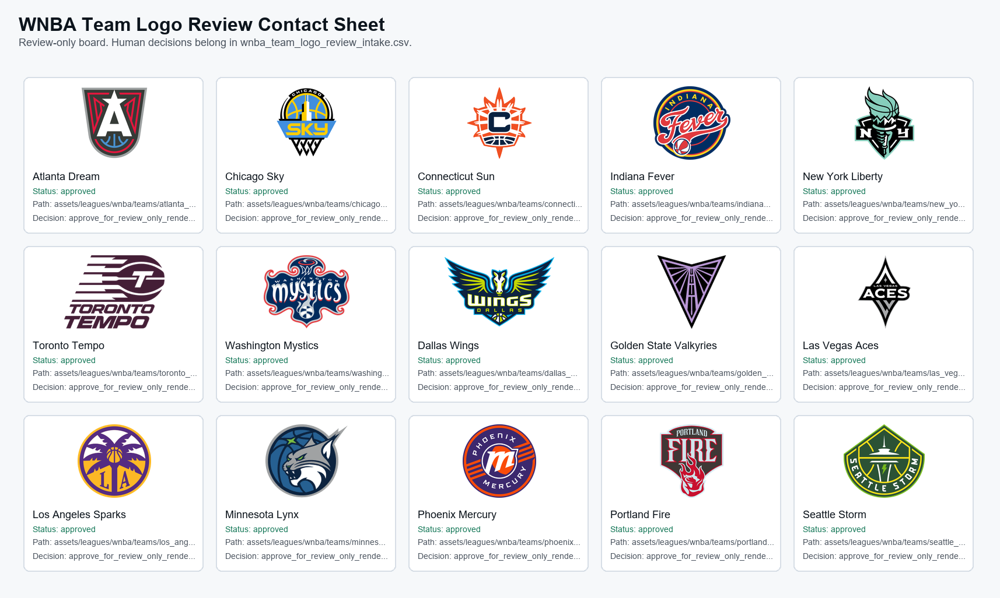

# WNBA Team Logo Contact Sheet

Generated: `2026-06-26T21:40:41.032549+00:00`

Review-only sweep board for every active WNBA team logo in the local registry. This file does not approve assets, download files, move files, publish, or create a publish-ready lane.

## Summary

- Teams: `15`
- Approved: `15`
- Needs manual review: `0`
- Human-edited intake CSV: `data/asset_registry/wnba/wnba_team_logo_review_intake.csv`
- Allowed decisions: `approve_for_review_only_renderer_use|deny_logo_asset|hold_for_more_evidence|revise_source_metadata`
- Guardrails: review_only=true; publish_ready=false; auto_approval=false; auto_publish=false; move_files=false; paid_apis=false; asset_downloads=false

## Rows

- Atlanta Dream | status=approved | local=assets/leagues/wnba/teams/atlanta_dream/logo.png | current_source=https://www.wnba.com/team/atlanta-dream | official_candidate=https://www.wnba.com/team/atlanta-dream | action=catalog_only_no_action
- Chicago Sky | status=approved | local=assets/leagues/wnba/teams/chicago_sky/logo.png | current_source=https://www.wnba.com/team/chicago-sky | official_candidate=https://www.wnba.com/team/chicago-sky | action=catalog_only_no_action
- Connecticut Sun | status=approved | local=assets/leagues/wnba/teams/connecticut_sun/logo.png | current_source=https://www.wnba.com/team/connecticut-sun | official_candidate=https://www.wnba.com/team/connecticut-sun | action=catalog_only_no_action
- Indiana Fever | status=approved | local=assets/leagues/wnba/teams/indiana_fever/logo.png | current_source=https://www.wnba.com/team/indiana-fever | official_candidate=https://www.wnba.com/team/indiana-fever | action=catalog_only_no_action
- New York Liberty | status=approved | local=assets/leagues/wnba/teams/new_york_liberty/logo.png | current_source=https://www.wnba.com/team/new-york-liberty | official_candidate=https://www.wnba.com/team/new-york-liberty | action=catalog_only_no_action
- Toronto Tempo | status=approved | local=assets/leagues/wnba/teams/toronto_tempo/logo.png | current_source=https://www.wnba.com/team/toronto-tempo | official_candidate=https://www.wnba.com/team/toronto-tempo | action=catalog_only_no_action
- Washington Mystics | status=approved | local=assets/leagues/wnba/teams/washington_mystics/logo.png | current_source=https://www.wnba.com/team/washington-mystics | official_candidate=https://www.wnba.com/team/washington-mystics | action=catalog_only_no_action
- Dallas Wings | status=approved | local=assets/leagues/wnba/teams/dallas_wings/logo.png | current_source=https://www.wnba.com/team/dallas-wings | official_candidate=https://www.wnba.com/team/dallas-wings | action=catalog_only_no_action
- Golden State Valkyries | status=approved | local=assets/leagues/wnba/teams/golden_state_valkyries/logo.png | current_source=https://www.wnba.com/team/golden-state-valkyries | official_candidate=https://www.wnba.com/team/golden-state-valkyries | action=catalog_only_no_action
- Las Vegas Aces | status=approved | local=assets/leagues/wnba/teams/las_vegas_aces/logo.png | current_source=https://www.wnba.com/team/las-vegas-aces | official_candidate=https://www.wnba.com/team/las-vegas-aces | action=catalog_only_no_action
- Los Angeles Sparks | status=approved | local=assets/leagues/wnba/teams/los_angeles_sparks/logo.png | current_source=https://www.wnba.com/team/los-angeles-sparks | official_candidate=https://www.wnba.com/team/los-angeles-sparks | action=catalog_only_no_action
- Minnesota Lynx | status=approved | local=assets/leagues/wnba/teams/minnesota_lynx/logo.png | current_source=https://www.wnba.com/team/minnesota-lynx | official_candidate=https://www.wnba.com/team/minnesota-lynx | action=catalog_only_no_action
- Phoenix Mercury | status=approved | local=assets/leagues/wnba/teams/phoenix_mercury/logo.png | current_source=https://www.wnba.com/team/phoenix-mercury | official_candidate=https://www.wnba.com/team/phoenix-mercury | action=catalog_only_no_action
- Portland Fire | status=approved | local=assets/leagues/wnba/teams/portland_fire/logo.png | current_source=https://www.wnba.com/team/portland-fire | official_candidate=https://www.wnba.com/team/portland-fire | action=catalog_only_no_action
- Seattle Storm | status=approved | local=assets/leagues/wnba/teams/seattle_storm/logo.png | current_source=https://www.wnba.com/team/seattle-storm | official_candidate=https://www.wnba.com/team/seattle-storm | action=catalog_only_no_action
