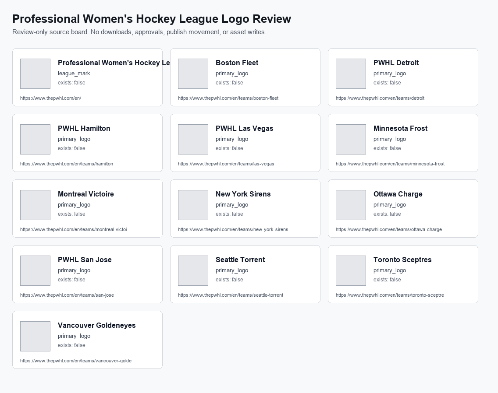

# Professional Women's Hockey League Logo Source Contact Sheet

Review-only board for league/team logo source candidates.

- Generated: `2026-06-27T17:45:32.813942+00:00`
- Rows: `13`
- No downloads, no auto-approval, no publish-ready movement.
- Human intake: `data/asset_registry/womens_hockey/womens_hockey_logo_review_intake.csv`

## Rows

- Professional Women's Hockey League | league_mark | https://www.thepwhl.com/en/
- Boston Fleet | primary_logo | https://www.thepwhl.com/en/teams/boston-fleet
- PWHL Detroit | primary_logo | https://www.thepwhl.com/en/teams/detroit
- PWHL Hamilton | primary_logo | https://www.thepwhl.com/en/teams/hamilton
- PWHL Las Vegas | primary_logo | https://www.thepwhl.com/en/teams/las-vegas
- Minnesota Frost | primary_logo | https://www.thepwhl.com/en/teams/minnesota-frost
- Montreal Victoire | primary_logo | https://www.thepwhl.com/en/teams/montreal-victoire
- New York Sirens | primary_logo | https://www.thepwhl.com/en/teams/new-york-sirens
- Ottawa Charge | primary_logo | https://www.thepwhl.com/en/teams/ottawa-charge
- PWHL San Jose | primary_logo | https://www.thepwhl.com/en/teams/san-jose
- Seattle Torrent | primary_logo | https://www.thepwhl.com/en/teams/seattle-torrent
- Toronto Sceptres | primary_logo | https://www.thepwhl.com/en/teams/toronto-sceptres
- Vancouver Goldeneyes | primary_logo | https://www.thepwhl.com/en/teams/vancouver-goldeneyes
