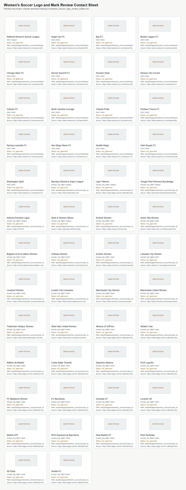

# Women's Soccer Logo Contact Sheet

Generated: `2026-06-27T00:15:02.425430+00:00`

Review-only sweep board for NWSL team logos plus a European top-flight source-candidate pilot. This file does not approve assets, download files, move files, publish, or create a publish-ready lane.

## Summary

- Rows: `50`
- League mark rows: `6`
- Team logo rows: `44`
- Human-edited intake CSV: `data/asset_registry/womens_soccer/womens_soccer_logo_review_intake.csv`
- Human review walkthrough: `data/asset_registry/womens_soccer/womens_soccer_logo_review_walkthrough.md`
- Allowed decisions: `approve_for_review_only_renderer_use|deny_logo_asset|hold_for_more_evidence|revise_source_metadata`
- Guardrails: review_only=true; publish_ready=false; auto_approval=false; auto_publish=false; move_files=false; paid_apis=false; asset_downloads=false

## Scope Counts

- `europe_top_flight`: `33`
- `nwsl`: `17`

## Rows

- National Women's Soccer League | scope=nwsl | type=league | status=not_approved | local=assets/leagues/womens_soccer/nwsl/league_mark.png | source_candidate=https://www.nwslsoccer.com/about-the-nwsl | action=manual_logo_or_mark_review_required
- Angel City FC | scope=nwsl | type=team | status=not_approved | local=assets/leagues/womens_soccer/nwsl/teams/angel_city_fc/logo.png | source_candidate=https://www.nwslsoccer.com/teams/9587b8ce40624165903b6bc9fd252634/angel-city-fc/index | action=manual_logo_or_mark_review_required
- Bay FC | scope=nwsl | type=team | status=not_approved | local=assets/leagues/womens_soccer/nwsl/teams/bay_fc/logo.png | source_candidate=https://www.nwslsoccer.com/teams/19674698cec24f53af8866cd21abaf8f/bay-fc/index | action=manual_logo_or_mark_review_required
- Boston Legacy FC | scope=nwsl | type=team | status=not_approved | local=assets/leagues/womens_soccer/nwsl/teams/boston_legacy_fc/logo.png | source_candidate=https://www.nwslsoccer.com/teams/d2d8efe548734dfd8bc667b5a52a079a/boston-legacy-fc/index | action=manual_logo_or_mark_review_required
- Chicago Stars FC | scope=nwsl | type=team | status=not_approved | local=assets/leagues/womens_soccer/nwsl/teams/chicago_stars_fc/logo.png | source_candidate=https://www.nwslsoccer.com/teams/269e825b853f4b43a9d38390aa92bf6e/chicago-stars-fc/index | action=manual_logo_or_mark_review_required
- Denver Summit FC | scope=nwsl | type=team | status=not_approved | local=assets/leagues/womens_soccer/nwsl/teams/denver_summit_fc/logo.png | source_candidate=https://www.nwslsoccer.com/teams/cbfcacbef5bc4a278442c00926ac9ebc/denver-summit-fc/index | action=manual_logo_or_mark_review_required
- Houston Dash | scope=nwsl | type=team | status=not_approved | local=assets/leagues/womens_soccer/nwsl/teams/houston_dash/logo.png | source_candidate=https://www.nwslsoccer.com/teams/ca3f464d6b794a9087d441d75961403f/houston-dash/index | action=manual_logo_or_mark_review_required
- Kansas City Current | scope=nwsl | type=team | status=not_approved | local=assets/leagues/womens_soccer/nwsl/teams/kansas_city_current/logo.png | source_candidate=https://www.nwslsoccer.com/teams/2c1699409ff84c9eb491aeaca3d3edde/kansas-city-current/index | action=manual_logo_or_mark_review_required
- Gotham FC | scope=nwsl | type=team | status=not_approved | local=assets/leagues/womens_soccer/nwsl/teams/gotham_fc/logo.png | source_candidate=https://www.nwslsoccer.com/teams/c83f2ca05aa84c738b5373f0d2a31b39/gotham-fc/index | action=manual_logo_or_mark_review_required
- North Carolina Courage | scope=nwsl | type=team | status=not_approved | local=assets/leagues/womens_soccer/nwsl/teams/north_carolina_courage/logo.png | source_candidate=https://www.nwslsoccer.com/teams/fb41ef4439dd495098cb6d40415767cc/north-carolina-courage/index | action=manual_logo_or_mark_review_required
- Orlando Pride | scope=nwsl | type=team | status=not_approved | local=assets/leagues/womens_soccer/nwsl/teams/orlando_pride/logo.png | source_candidate=https://www.nwslsoccer.com/teams/c3e9513e280b41e5bfbb8230076e8c43/orlando-pride/index | action=manual_logo_or_mark_review_required
- Portland Thorns FC | scope=nwsl | type=team | status=not_approved | local=assets/leagues/womens_soccer/nwsl/teams/portland_thorns_fc/logo.png | source_candidate=https://www.nwslsoccer.com/teams/96ba7b37bd8544a1a7329183459150ff/portland-thorns-fc/index | action=manual_logo_or_mark_review_required
- Racing Louisville FC | scope=nwsl | type=team | status=not_approved | local=assets/leagues/womens_soccer/nwsl/teams/racing_louisville_fc/logo.png | source_candidate=https://www.nwslsoccer.com/teams/ac29701756da44a08457762380c10733/racing-louisville-fc/index | action=manual_logo_or_mark_review_required
- San Diego Wave FC | scope=nwsl | type=team | status=not_approved | local=assets/leagues/womens_soccer/nwsl/teams/san_diego_wave_fc/logo.png | source_candidate=https://www.nwslsoccer.com/teams/ca719042b34443c4bcfe380ca4850eaf/san-diego-wave-fc/index | action=manual_logo_or_mark_review_required
- Seattle Reign | scope=nwsl | type=team | status=not_approved | local=assets/leagues/womens_soccer/nwsl/teams/seattle_reign/logo.png | source_candidate=https://www.nwslsoccer.com/teams/1151140adfc24339ba1c93cb0b6b0238/seattle-reign/index | action=manual_logo_or_mark_review_required
- Utah Royals FC | scope=nwsl | type=team | status=not_approved | local=assets/leagues/womens_soccer/nwsl/teams/utah_royals_fc/logo.png | source_candidate=https://www.nwslsoccer.com/teams/acffc559cf7d485a9c05fa23ab57054b/utah-royals-fc/index | action=manual_logo_or_mark_review_required
- Washington Spirit | scope=nwsl | type=team | status=not_approved | local=assets/leagues/womens_soccer/nwsl/teams/washington_spirit/logo.png | source_candidate=https://www.nwslsoccer.com/teams/c31d72afc09f42ee86418633aa41390a/washington-spirit/index | action=manual_logo_or_mark_review_required
- Barclays Women's Super League | scope=europe_top_flight | type=league | status=not_approved | local=assets/leagues/womens_soccer/europe_top_flight/wsl_england/league_mark.png | source_candidate=https://www.wslfootball.com/ | action=manual_logo_or_mark_review_required
- Liga F Moeve | scope=europe_top_flight | type=league | status=not_approved | local=assets/leagues/womens_soccer/europe_top_flight/liga_f_spain/league_mark.png | source_candidate=https://www.laliga.com/en-GB/futbol-femenino | action=manual_logo_or_mark_review_required
- Google Pixel Womens Bundesliga | scope=europe_top_flight | type=league | status=not_approved | local=assets/leagues/womens_soccer/europe_top_flight/frauen_bundesliga_germany/league_mark.png | source_candidate=https://www.dfb.de/en/women/womens-bundesliga | action=manual_logo_or_mark_review_required
- Arkema Premiere Ligue | scope=europe_top_flight | type=league | status=not_approved | local=assets/leagues/womens_soccer/europe_top_flight/premiere_ligue_france/league_mark.png | source_candidate=https://uk.fff.fr/ | action=manual_logo_or_mark_review_required
- Serie A Women Athora | scope=europe_top_flight | type=league | status=not_approved | local=assets/leagues/womens_soccer/europe_top_flight/serie_a_women_italy/league_mark.png | source_candidate=https://www.figc.it/it/femminile/ | action=manual_logo_or_mark_review_required
- Arsenal Women | scope=europe_top_flight | type=team | status=not_approved | local=assets/leagues/womens_soccer/europe_top_flight/wsl_england/teams/arsenal_women/logo.png | source_candidate=https://www.arsenal.com/women | action=manual_logo_or_mark_review_required
- Aston Villa Women | scope=europe_top_flight | type=team | status=not_approved | local=assets/leagues/womens_soccer/europe_top_flight/wsl_england/teams/aston_villa_women/logo.png | source_candidate=https://www.avfc.co.uk/teams/womens | action=manual_logo_or_mark_review_required
- Brighton & Hove Albion Women | scope=europe_top_flight | type=team | status=not_approved | local=assets/leagues/womens_soccer/europe_top_flight/wsl_england/teams/brighton_hove_albion_women/logo.png | source_candidate=https://www.brightonandhovealbion.com/pages/en/womens-team | action=manual_logo_or_mark_review_required
- Chelsea Women | scope=europe_top_flight | type=team | status=not_approved | local=assets/leagues/womens_soccer/europe_top_flight/wsl_england/teams/chelsea_women/logo.png | source_candidate=https://www.chelseafc.com/en/teams/chelsea-women | action=manual_logo_or_mark_review_required
- Everton Women | scope=europe_top_flight | type=team | status=not_approved | local=assets/leagues/womens_soccer/europe_top_flight/wsl_england/teams/everton_women/logo.png | source_candidate=https://www.evertonfc.com/teams/women | action=manual_logo_or_mark_review_required
- Leicester City Women | scope=europe_top_flight | type=team | status=not_approved | local=assets/leagues/womens_soccer/europe_top_flight/wsl_england/teams/leicester_city_women/logo.png | source_candidate=https://www.lcfc.com/pages/en/women | action=manual_logo_or_mark_review_required
- Liverpool Women | scope=europe_top_flight | type=team | status=not_approved | local=assets/leagues/womens_soccer/europe_top_flight/wsl_england/teams/liverpool_women/logo.png | source_candidate=https://www.liverpoolfc.com/team/womens | action=manual_logo_or_mark_review_required
- London City Lionesses | scope=europe_top_flight | type=team | status=not_approved | local=assets/leagues/womens_soccer/europe_top_flight/wsl_england/teams/london_city_lionesses/logo.png | source_candidate=https://www.londoncitylionesses.com/ | action=manual_logo_or_mark_review_required
- Manchester City Women | scope=europe_top_flight | type=team | status=not_approved | local=assets/leagues/womens_soccer/europe_top_flight/wsl_england/teams/manchester_city_women/logo.png | source_candidate=https://www.mancity.com/teams/mcwfc | action=manual_logo_or_mark_review_required
- Manchester United Women | scope=europe_top_flight | type=team | status=not_approved | local=assets/leagues/womens_soccer/europe_top_flight/wsl_england/teams/manchester_united_women/logo.png | source_candidate=https://www.manutd.com/en/teams/women | action=manual_logo_or_mark_review_required
- Tottenham Hotspur Women | scope=europe_top_flight | type=team | status=not_approved | local=assets/leagues/womens_soccer/europe_top_flight/wsl_england/teams/tottenham_hotspur_women/logo.png | source_candidate=https://www.tottenhamhotspur.com/teams/women/ | action=manual_logo_or_mark_review_required
- West Ham United Women | scope=europe_top_flight | type=team | status=not_approved | local=assets/leagues/womens_soccer/europe_top_flight/wsl_england/teams/west_ham_united_women/logo.png | source_candidate=https://www.whufc.com/teams/women | action=manual_logo_or_mark_review_required
- Alhama CF ElPozo | scope=europe_top_flight | type=team | status=not_approved | local=assets/leagues/womens_soccer/europe_top_flight/liga_f_spain/teams/alhama_cf_elpozo/logo.png | source_candidate=https://www.laliga.com/en-GB/futbol-femenino | action=manual_logo_or_mark_review_required
- Athletic Club | scope=europe_top_flight | type=team | status=not_approved | local=assets/leagues/womens_soccer/europe_top_flight/liga_f_spain/teams/athletic_club/logo.png | source_candidate=https://www.laliga.com/en-GB/futbol-femenino | action=manual_logo_or_mark_review_required
- Atlético de Madrid | scope=europe_top_flight | type=team | status=not_approved | local=assets/leagues/womens_soccer/europe_top_flight/liga_f_spain/teams/atletico_de_madrid/logo.png | source_candidate=https://www.laliga.com/en-GB/futbol-femenino | action=manual_logo_or_mark_review_required
- Costa Adeje Tenerife | scope=europe_top_flight | type=team | status=not_approved | local=assets/leagues/womens_soccer/europe_top_flight/liga_f_spain/teams/costa_adeje_tenerife/logo.png | source_candidate=https://www.laliga.com/en-GB/futbol-femenino | action=manual_logo_or_mark_review_required
- Deportivo Abanca | scope=europe_top_flight | type=team | status=not_approved | local=assets/leagues/womens_soccer/europe_top_flight/liga_f_spain/teams/deportivo_abanca/logo.png | source_candidate=https://www.laliga.com/en-GB/futbol-femenino | action=manual_logo_or_mark_review_required
- DUX Logroño | scope=europe_top_flight | type=team | status=not_approved | local=assets/leagues/womens_soccer/europe_top_flight/liga_f_spain/teams/dux_logrono/logo.png | source_candidate=https://www.laliga.com/en-GB/futbol-femenino | action=manual_logo_or_mark_review_required
- FC Badalona Women | scope=europe_top_flight | type=team | status=not_approved | local=assets/leagues/womens_soccer/europe_top_flight/liga_f_spain/teams/fc_badalona_women/logo.png | source_candidate=https://www.laliga.com/en-GB/futbol-femenino | action=manual_logo_or_mark_review_required
- FC Barcelona | scope=europe_top_flight | type=team | status=not_approved | local=assets/leagues/womens_soccer/europe_top_flight/liga_f_spain/teams/fc_barcelona/logo.png | source_candidate=https://www.laliga.com/en-GB/futbol-femenino | action=manual_logo_or_mark_review_required
- Granada CF | scope=europe_top_flight | type=team | status=not_approved | local=assets/leagues/womens_soccer/europe_top_flight/liga_f_spain/teams/granada_cf/logo.png | source_candidate=https://www.laliga.com/en-GB/futbol-femenino | action=manual_logo_or_mark_review_required
- Levante UD | scope=europe_top_flight | type=team | status=not_approved | local=assets/leagues/womens_soccer/europe_top_flight/liga_f_spain/teams/levante_ud/logo.png | source_candidate=https://www.laliga.com/en-GB/futbol-femenino | action=manual_logo_or_mark_review_required
- Madrid CFF | scope=europe_top_flight | type=team | status=not_approved | local=assets/leagues/womens_soccer/europe_top_flight/liga_f_spain/teams/madrid_cff/logo.png | source_candidate=https://www.laliga.com/en-GB/futbol-femenino | action=manual_logo_or_mark_review_required
- RCD Espanyol de Barcelona | scope=europe_top_flight | type=team | status=not_approved | local=assets/leagues/womens_soccer/europe_top_flight/liga_f_spain/teams/rcd_espanyol_de_barcelona/logo.png | source_candidate=https://www.laliga.com/en-GB/futbol-femenino | action=manual_logo_or_mark_review_required
- Real Madrid CF | scope=europe_top_flight | type=team | status=not_approved | local=assets/leagues/womens_soccer/europe_top_flight/liga_f_spain/teams/real_madrid_cf/logo.png | source_candidate=https://www.laliga.com/en-GB/futbol-femenino | action=manual_logo_or_mark_review_required
- Real Sociedad | scope=europe_top_flight | type=team | status=not_approved | local=assets/leagues/womens_soccer/europe_top_flight/liga_f_spain/teams/real_sociedad/logo.png | source_candidate=https://www.laliga.com/en-GB/futbol-femenino | action=manual_logo_or_mark_review_required
- SD Eibar | scope=europe_top_flight | type=team | status=not_approved | local=assets/leagues/womens_soccer/europe_top_flight/liga_f_spain/teams/sd_eibar/logo.png | source_candidate=https://www.laliga.com/en-GB/futbol-femenino | action=manual_logo_or_mark_review_required
- Sevilla FC | scope=europe_top_flight | type=team | status=not_approved | local=assets/leagues/womens_soccer/europe_top_flight/liga_f_spain/teams/sevilla_fc/logo.png | source_candidate=https://www.laliga.com/en-GB/futbol-femenino | action=manual_logo_or_mark_review_required
